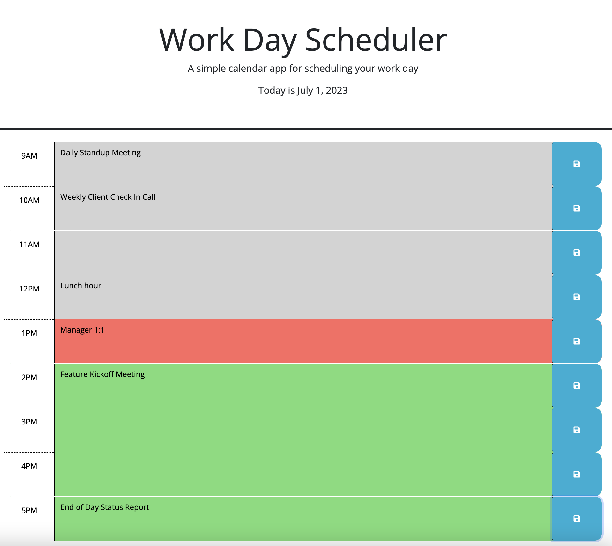
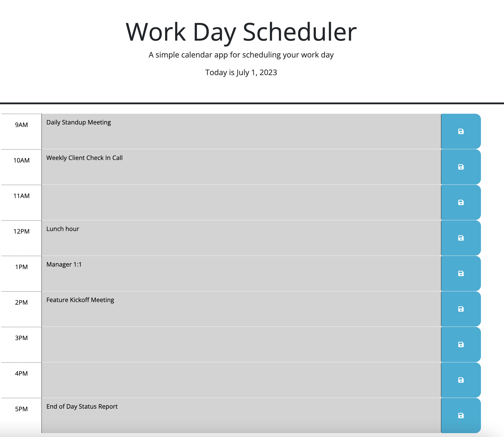

# Work Day Scheduler

## Description

The goal of this project is to leverage third party APIs to add more functionality to a website. This webite uses DayJS, jQuery, Bootstrap, FontAwesome, and Google Fonts. DayJS allows us to update the site based on the time and day, jQuery allows us to more easily navigate the DOM, and Bootstrap, FontAwesome, and Google Fonts allows us to control the visual appearance of the site. 

The resulting webite allows the user to schedule activities for each hour of the work day. The schedule is dynamically colored depending on if the block of time is in the past, present, or future. The entries are saved locally, so they will persist if the user refreshes or navigates away from the page.

## Installation

The application is deployed here: [https://lucygouvin.github.io/work-day-scheduler/](https://lucygouvin.github.io/work-day-scheduler/)

## Usage

1. When you load the page, the current date will automatically be displayed at the top of the page. The blocks of time will also be automatically color coded. Blocks of time in the past will be gray, the current hour will be red, and blocks in the future will be green.
1. Click on an hour timeblock, and type the activity you'd like to schedule for that time.
2. Press the blue button with the save icon to the right of the time block.
3. The entry is now saved locally. If you refresh the page, the activities will still appear.
4. The function to update the colors on the timeblocks re-triggers at the top of every hour, to ensure the coloring is always accurate.

## Credits

Used this Stack Overlow question to get the idea of using setTimeout in conjunction with setInterval: [https://stackoverflow.com/questions/1280263/changing-the-interval-of-setinterval-while-its-running](https://stackoverflow.com/questions/1280263/changing-the-interval-of-setinterval-while-its-running)

## License

Please refer to the license in this repo.